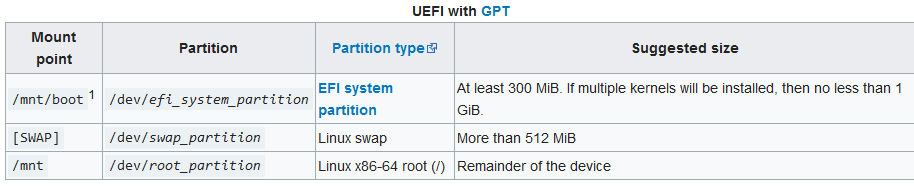

Volver a [ArchLinux](./ArchLinux.md)

# Instalar ArchLinux

[ArchLinux](./ArchLinux.md) tiene la mala fama de ser complejo de instalar, pero idealmente, siguiendo esta guía será mucho más sencillo.

La mayoría de esta guía fue obtenida de [ArchLinux Installation Guide](https://wiki.archlinux.org/title/installation_guide) y [Arch Linux: A ℂ𝕠𝕞𝕗𝕪 Install Guide](https://www.youtube.com/watch?v=68z11VAYMS8)

Se asume que ya se descargó el .iso de la página [ArchLinux Downloads](https://archlinux.org/download/) y que se flasheo la imagen en un USB o similar.

Para instalar Arch como contenedor en con Docker, entonces ir a [Comandos Dockers y WSL > Descargar una imagen](../../Dockers%20y%20WSL/Comandos%20Dockers%20y%20WSL.md#Descargar%20una%20imagen)
Para instalar Arch en WSL, entonces ir a [Comandos Dockers y WSL > Instalar otras distribuciones](../../Dockers%20y%20WSL/Comandos%20Dockers%20y%20WSL.md#Instalar%20otras%20distribuciones)

# Primeros pasos

``` bash
# Esto pone el teclado en español.
loadkeys es

# Para conectarse al wifi hay que hacer esto
iwctl

# Muestra todos los adaptadores de red disponibles
device list 

# Si el que necesitas no está ON, entonces usar
device NOMBRE set-property Powered on
adapter ADAPTADOR set-property Powered on

# Para ver los wifi disponibles usar
station NOMBRE scan
station NOMBRE get-networks

# Para conectarse a una red.
# Luego pedirá la contraseña 
station NOMBRE connect SSID

# Se puede hacer en una sola línea
--passphrase passphrase station device connect SSID

# Configura los tiempos
timedatectl set-ntp true
timedatectl
```

# Partición de discos

```bash
# Para ver los discos que hay
lsblk

# Para ver las particiones
cfdisk /dev/NOMBREdisco
```

En las particiones tienes que hacer 3, una para el boot, una para el Swap, y otra para el resto.

1. 512 mb pal boot
2. 4 GB pal swap
3. Lo que sobre para el resto



```bash
# Ahora se formatean las particiones
mkfs.ext4 /dev/ROOTpartition
mkfs.fat -F 32 /dev/EFIsystemPARTITION
mksawp /dev/SWAPpartition
```

# Montar los file systems

```bash
# Para el root
mount /dev/ROOTpartition /mnt
# Para el boot
mount --mkdir /dev/EFIsystemPARTITION /mnt/boot/efi
# Para el swap
swapon /dev/SWAPpartition
```

# Instalar el resto

```bash
# Instala cosas importantes
pacstrap -K /mnt linux linux-firmware base base-devel vim git sof-firmware grub efibootmgr
nano networkmanager

# Mugre que no sé que hace
genfstab -U /mnt >> /mnt/etc/fstab

#
arch-chroot /mnt /bin/bash

# Configura el tiempo
# Obviamente aquí hay que cambiar según corresponda
ln -sf /usr/share/zoneinfo/America/Santiago /etc/localtime
date
hwclock --systohc

# Aquí tienes que meterte al archivo y
# borrar el # del es_CL.UTF-88 o us_EN.UTF-8
# Lo ideal sería dejarlo en inglés para no
# Tener problemas de configuración
nano etc/locale.gen 
locale-gen

# Escribir LANG=es_CL.UTF-8 o LANG=us_EN.UTF-8
# según lo que se hizo en el paso anterior
nano etc/locale.conf
LANG=es_CL.UTF-8
LANG=us_EN.UTF-8

# Escribir KEYMAP=es par dejar el teclado en español
# Obviamente si tienes otro teclado cambiarlo por ese
nano /etc/vconsole.conf
KEYMAP=es

# Escribir el nombre del pc
nano /etc/hostname

# Crea la constraseña del root
passwd

# Crea un nuevo usuario que no sea root
# y crea contraseña para ese usuario
useradd -m -G wheel -s /bin/bash nekoarchuser
passwd nekoarchuser

# Agregar wheel a los Sudoers y descomentar el # %wheel
EDITOR=nano visudo

# Activar el servicio de internet
systemctl enable NetworkManager

# Esto es para que GRUB detecte otros sistemas operativos
# No siempre funciona
# El amd-ucode instala cosas para hardware y cpu AMD
# Si se tiene chips Intel entonces cambiar por intel-ucode
pacman -S os-prober amd-ucode
os-prober

# Descomentar el GRUB_DISABLE_OS_PROBER=false
nano /etc/default/grub

# Aplicar grub
grub-install /dev/NOMBREdisco
grub-mkconfig -o /boot/grub/grub.cfg

# Lo último antes de salir
exit
umount -R /mnt
```

# Para WIFI

Una vez estando en el sistema, para conectarse a wifi utilizar los siguientes comandos:

```bash
nmcli d
nmcli r wifi on
nmcli d wifi list
nmcli d wifi connect SSID password PASS
```

Volver a [ArchLinux](./ArchLinux.md)
